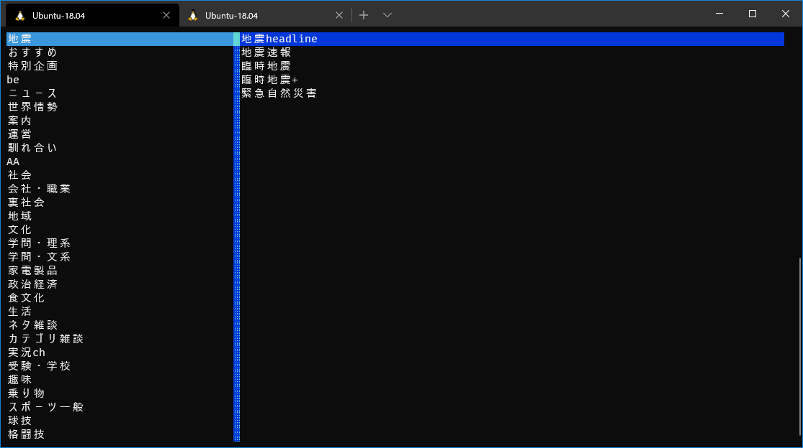

# Gochan

ターミナルで動く専用ブラウザ



## 動作環境

- Linux or WSL
- Python >= 3.5

Macは動くかどうか分からない

## インストール方法

`pip install gochan`

## コマンド

スレッド一覧
- up/down : スレッドを選択
- enter : スレッドを開く
- q : レス番号昇順でソート
- Q : レス番号降順 
- w : タイトル昇順
- W : タイトル降順
- e : レス数昇順
- E : レス数降順
- r : 勢い昇順
- R : 勢い降順

スレッドビュー
- o : リンクをブラウザで開く(*WSLの場合は追加設定が必要)
- a : 画像をASCIIで表示する

## 設定
~/.config/gochan/conf.json に記述する

項目
- browser_path : 

    リンクを開く際に使用するブラウザのパス

    指定されなければデフォルトのブラウザが使用される
    
    ただしWSLにおいてはデフォルトブラウザのパスが設定されていないので自分で書く必要がある

    Chromeを指定したいのなら、以下のように設定すれば動くはず(WSLからCドライブへは/mnt/cでアクセスすることに注意)

    ```
    {
        "browser_path" : "/mnt/c/Program Files (x86)/Google/Chrome/Application/chorome.exe"
    }
    ```

- use_cache :
 
    画像をASCIIで表示する場合、画像のダウンロードが必要になるがそれをキャッシュとして保存するかどうか

- max_cache : 最大何枚のキャッシュを保存するか    


## キーバインディング

~/.config/gochan/keybindings.jsonに記述する

```
{
    "bbsmenu": {
        "select_up": "up",
        "select_down": "down",
        "page_up": "page_up",
        "page_down": "page_down",
        "select_top": "C-home",
        "select_bottom": "C-end",
        "select": "enter",
    },
    "board": {
        "select_up": "up",
        "select_down": "down",
        "page_up": "page_up",
        "page_down": "page_down",
        "select_top": "C-hoem",
        "select_bottom": "C-end",
        "select": "enter",
        "sort_1": "q",
        "dsort_1": "S-q",
        "sort_2": "w",
        "dsort_2": "S-w",
        "sort_3": "e",
        "dsort_3": "S-e",
        "sort_4": "r",
        "dsort_4": "S-r"
    },
    "thread": {
        "open_link": "o",
        "scroll_up": "up",
        "scroll_down": "down",
        "page_up": "page_up",
        "page_down": "page_down",
        "go_to_top": "C-home",
        "go_to_bottom": "C-end"
    }
}
```

### 修飾キーの指定方法

Ctrl-x, Shift-x, またはC-x, S-x

組み合わせても使える Ctrl-S-x
